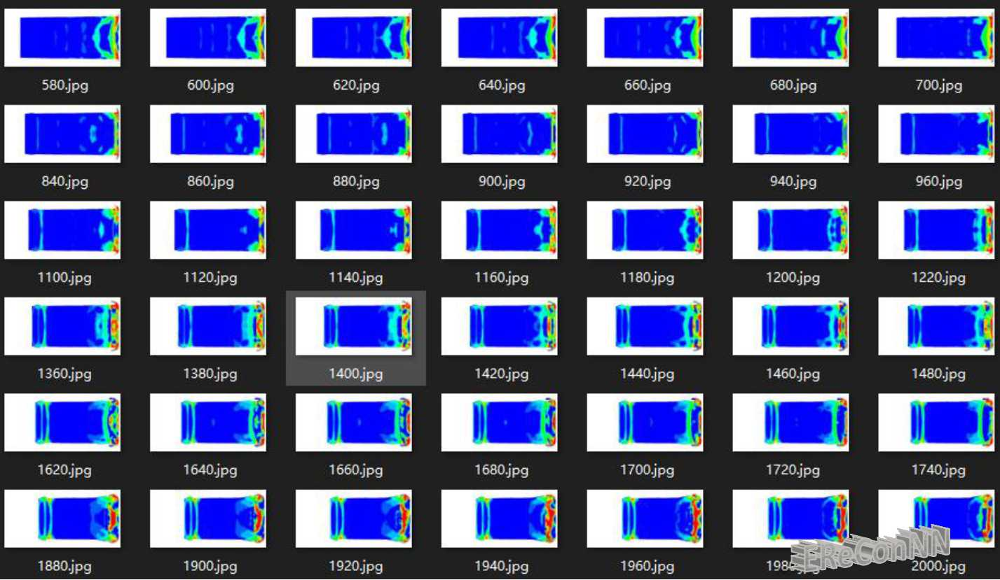
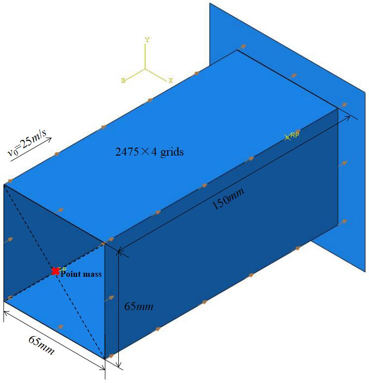

# Data-set-of-a-3D-impact-case
The warehouse of the training samples of the EReConNN

The 3D Computer Aided Design (CAD) model of the impact problem is presented. The impact body is a cuboid whose material is Al alloy 6061-T6 as shown in Table 1, and defined with an initial velocity v0 along the negative direction of z-axis. Furthermore, a point mass of 300kg is coupled in the center of the other side of the collision surface, which is marked by using a red cross.

The dataset of the impact process contains 5,633 images. The pixels of each one is '480x960x3'.
